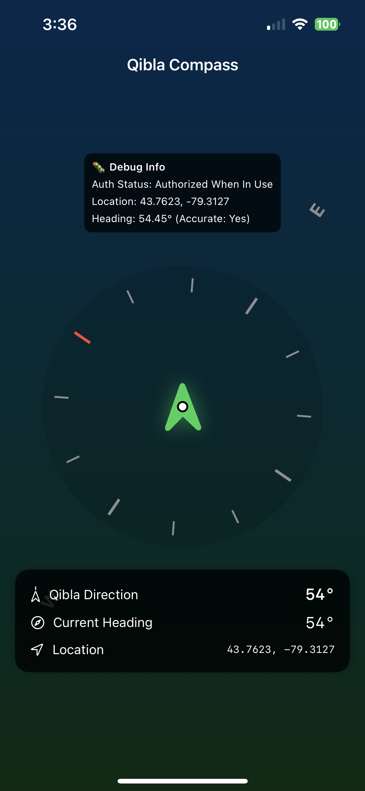

# Qibla Direction App

This is a simple iOS application built with SwiftUI that helps users find the direction of the Qibla (the direction towards the Kaaba in Mecca).

## Features

*   **Qibla Direction:**  Calculates and displays the Qibla direction based on the user's current location.
*   **Compass View:**  A simple compass that shows the user's current heading and the direction of the Qibla.
*   **Location Services:** Uses the device's location services to get the user's current latitude and longitude.
*   **API Integration:**  Fetches the Qibla direction from the Aladhan API.
*   **User-friendly Interface:**  A clean and simple interface that is easy to use.

## How it Works

1.  The app requests permission to use the device's location services.
2.  Once the location is obtained, it makes an API call to `api.aladhan.com` to get the Qibla direction for that location.
3.  The app displays a compass view with an arrow pointing towards the Qibla.
4.  The compass also shows the user's current heading, so they can align themselves with the Qibla direction.

## To-Do

*   Add support for more languages.
*   Improve the accuracy of the compass.
*   Add a map view to show the user's location and the direction of the Qibla.

## Screenshots

## Installation

1.  Clone the repository.
2.  Open the project in Xcode.
3.  Build and run the app on your iOS device.

## Credits

*   **API:** [Aladhan API](https://aladhan.com/prayer-times-api)
*   **Icons:** [Apple SF Symbols](https://developer.apple.com/sf-symbols/)

